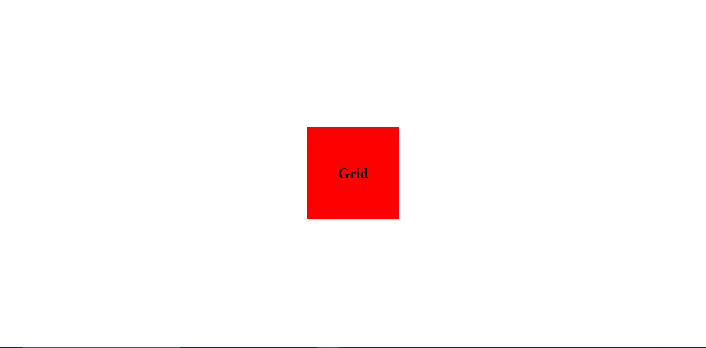

In this article, Let us understand how to perfectly center a div element using CSS in four simple ways (using Flex-box, grid, position/transform, Margins).

### 1) Flex-Box
By Selecting a Parent element of a div which we want to Center, we can simply use Flex-box to center the div element. We First need to apply Display of flex to the parent element and then apply justify-content: center and align-items: center. That's it, by doing so the Div element will be perfectly centered. For eg,

```CSS
HTML:
<body>
    <div class="container"></div>
</body>

CSS:
body{
    margin:0;
    padding: 0;
    height: 100vh;
    box-sizing: border-box;
    display: flex;
    justify-content: center;
    align-items: center;
}
.container{
    width: 200px;
    height: 200px;
    background-color: red;
}

```
Output:


### 2) Grid
To center an element using Grid we just have to apply display of grid to the parent element and after that apply place-contents:center. See the example below,

```CSS
HTML:
<body>
    <div class="container">
        <h1>Grid</h1>
    </div>
</body>
CSS:
body{
    margin:0;
    padding: 0;
    height: 100vh;
    box-sizing: border-box;
    display: grid;
    place-content: center;
}
.container{
    width: 200px;
    height: 200px;
    background-color: red;
    display: grid;
    place-content: center;
}
```
Output:

In above example, we have centered two elements. Here, h1 & div elements are centered using grid where h1 is child of div and div is child of body.

### 3) Postion(absolute/relative), Transform, left, top
Using position(absolute/relative) is very useful in CSS, though it is most often used in psuedo-elements, it can be useful in other part as well. We can use it for centering the element too.
Giving position property to an element enables us to use left,top,bottom,right property with the help of which we can position an element the way we want it to be positioned. In our case we want to position an element(div) at center. So what we can do is we can give a position:absolute property to the div and then give left:50% & top:50%, this two properties will push the element 50% from top and 50% from the left. However it will not completely center element. To completely center it we need to use Trasnform property as transform:translate(-50%,-50%); to pull back 50% from top and left within the size of the div(container) in order to perfectly center the element.
```CSS
.container{
    width: 200px;
    height: 200px;
    background-color: red;
    position: absolute;
    top: 50%;
    left: 50%;
    transform: translate(-50%,-50%);
}
``` 
The above code will perfectly center The selected DOM Element.

**Note: using position:relative in above code will also work the same way in our current scenario though absolute and relative are quite different.**

### 4) Margin
Well this method is only helpful to center the element horizontally. Giving a property of margin: 0 auto; will center the selected Dom element horizontally.
```CSS
.container{
    width: 200px;
    height: 200px;
    background-color: red;
    margin:0 auto;
}
```
Ouput:


In above example we gave margin of 0 auto to the div resulting in horizontally centered div. However it is sticked to the top since the top-bottom margin is set to 0. If we increase the first value from 0 to more than 0 the div will be pushed downward from the top by the value which was passed with property. For eg, if margin: 50px auto;  then red div will be 50px away from the top and will be horizontally centered.

**Note: Flex-box & Grid properties are applied on parent element whereas Position and margin properties are applied on the element which we want to center.**