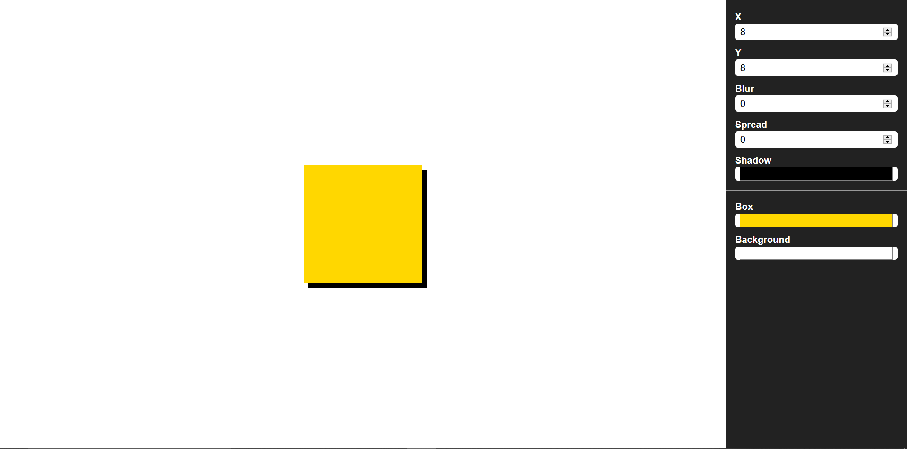
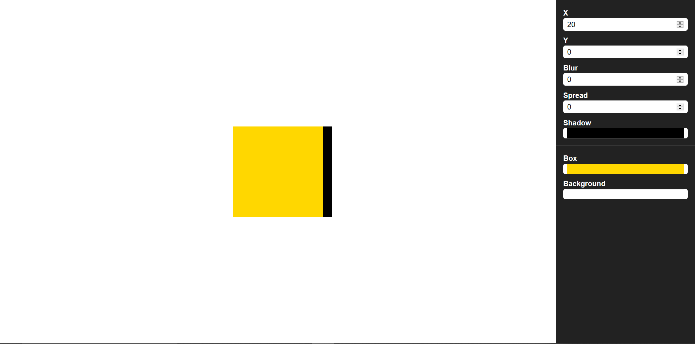
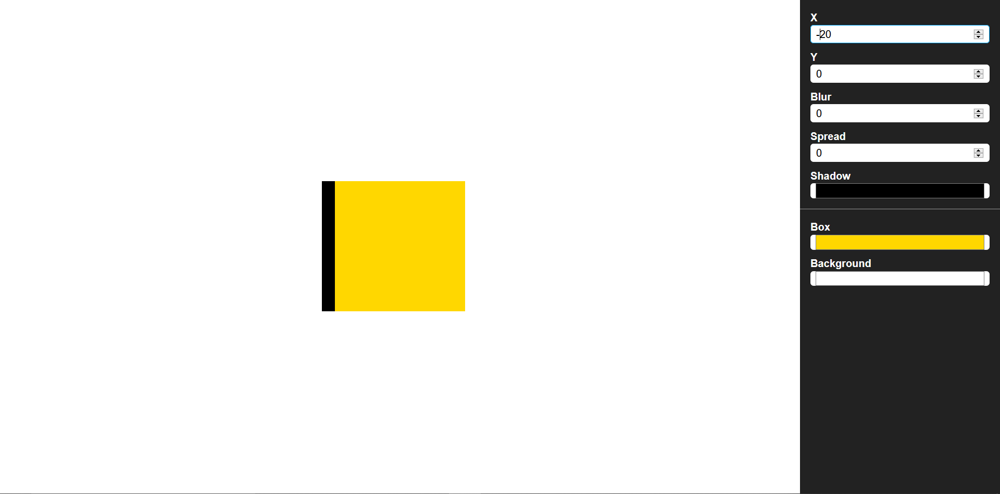
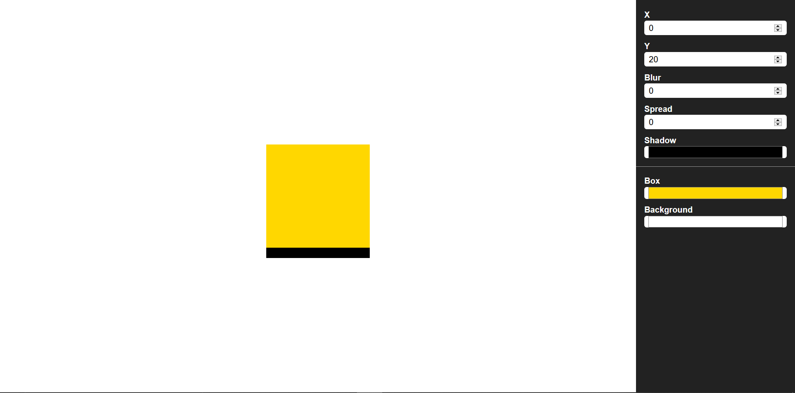
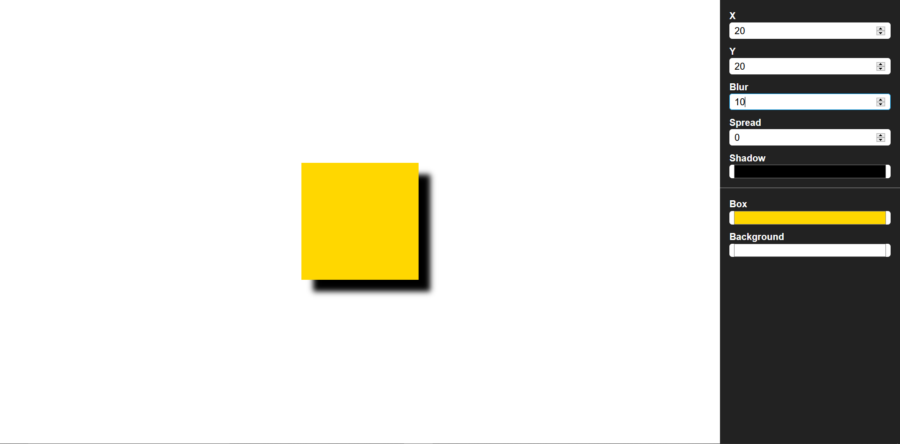
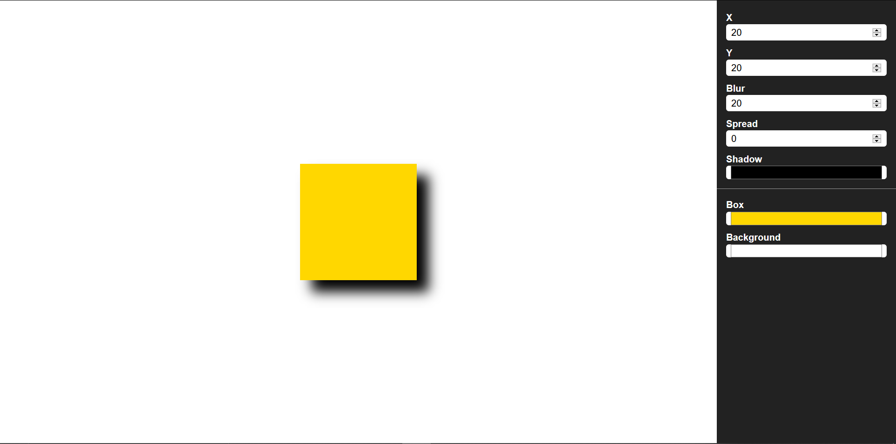
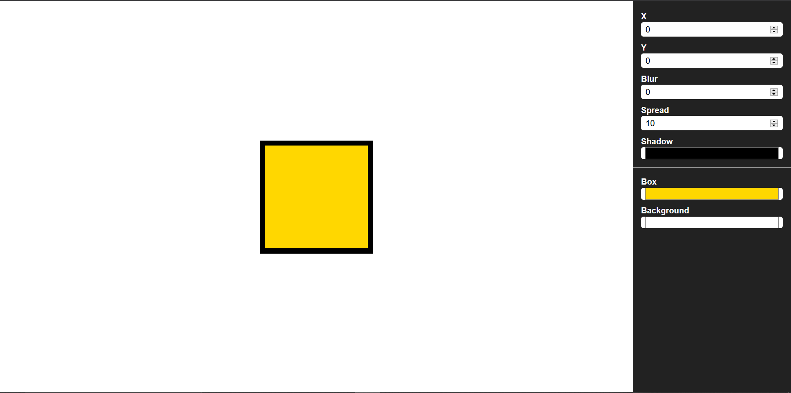

### This article might help in understanding the concept of one of the most confusing CSS property **box-shadow**

Box shadow property has 5 values in total i.e Horizontal offset, Vertical offset, Blur, Spread and Shadow color

we all know this but still it is quite confusing while putting it into practice. Most of us find it difficult to understand how each of the 5 values of Box-shadow property is affecting the selected DOM element.

**Basic Syntax**
```
#element{
    box-shadow: horizontal vertical blur spread shadow-color;
}
```
First i want to talk about the default values of this property,

**Blur and Spread is set to 0 by default and Shadow color is set to black by default** 

Also, Note that if we do not include any or all of these 3 values of the property it will still be valid and will not throw any error. For eg,
```
#element{
    box-shadow: 8px 8px;
}
```
The above code is equivalent to 
```
#element{
    box-shadow: 8px 8px 0px 0px black;
}

```
This will be the effect of above code on a DOM element



**Now I would want to talk about each values of this property seperately to make us understand the concept better**

**Horizontal offset**

Horizontal offset hold either a positive or a negative value. Negative value will Horizontally offset the DOM element's shadow(black strip in case of image below) towards left side and positive value will offset it towards right side. To understand this consider x-axis for an example, on x-axis negative values lies towards the left side and positive values lies towards the right side of the axis.
To understand it better let us see an image.



In this image I have set all the property's value to be zero and given horziontal offset a value of 20px. We can see that a strip of 20px is appearing towards the right of the yellow box(which our selected DOM element) which means that the shadow is offsetted 20px towards right. If I would give -20px value to horzontal offset then the same strip appear on the left side(shadow offsetted 20px towards left) of the yellow box(see image below) .



**Vertical offset**

Vertical offset can also have either a negative or a positive value. Negative value implies upward offset while positive value implies downward offset. For an example, we can think of a y-axis(but with opposite sign convention).



In above image I have set vertical offset value to be 20px, and kept rest of the property's value to be 0. We can se a black strip at the bottom which implies that DOM element's(yellow box in this case) shadow is offsetted 20px downwards, similarly if we give -20px to this property we will see a 20px strip above the yellow box.

**Blur**

This property blurs the offset of the selected DOM element. The blur-size provided to the property tells it to blur the offset with given blur-size.
for Eg. if vertical and horizontal offset is given as 40px each and blur size given as 20px then only 20px out of the offsetted 40px will be blured from the outline of the shadow i.e the remaining offsetted 20px will be between the DOM element and blurred offset.



In above image I have applied 20px horizontal and vertical offset and a blur of 10px. So measuring from outer side i.e from the starting of black strip 10px is blurred out of the offsetted 20px.



Now what I did is, I kept horizontal and vertical offset to be 20px and also gave a blur of 20px. Complete offsetted strip is blurred i.e 20px strip

**Spread**

This property spread the shadow in all four direction of the selected DOM element upto the value provided to the spread property. Now the question would arise how shadow is spread so, if the we select spread-size to be 20px then, a black color(if shadow color property is not provided else the provided shadow color) layer of 20px will be visible around the DOM element. To understand it better look at the below image.



In the above image i have set all property to be zero except for spread property. I have set spread to be equal to 10px and shadow color is black. So what we can see is a 10px solid border is applied to the DOM element(a yellow square in this case).

This is How Box-shadow property works in CSS. However, There are more advanced ways to implement it. By advanced I mean that we can use it in nested form too(multiple values). 

PS: The images illustrating the box-shadow examples above is created using a tool i created for visualizing box-shadow you can try it out. **[Checkout the tool here](https://visual-editor-box-shadow.netlify.app/).**

